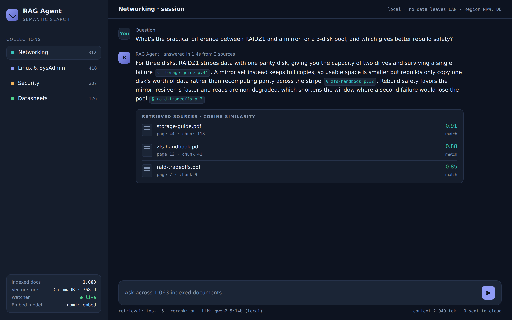

# 🧠 RAG Agent: Local AI Document Intelligence


> [!NOTE]
> **PURPOSE:** A fully self-hosted AI agent that indexes and semantically searches private document collections — combining local LLMs with vector embeddings for intelligent, privacy-preserving document Q&A.

<p align="center">
  
  <br><em>Semantic Q&A with source citations · demo data</em>
</p>

---

## 01 — 📖 Project Overview

**RAG Agent** is a local Retrieval-Augmented Generation system built for private document collections. It automatically indexes PDFs and text files into a vector database, then exposes a chat interface where a multi-tool agent loop retrieves relevant context and generates accurate, grounded answers — entirely on-premise, with no data leaving the machine.

Designed to scale to thousands of documents with real-time auto-indexing as new files are added.

---

## 02 — ✨ Key Features

| Feature | Description |
| :--- | :--- |
| 🔍 **Semantic Search** | Vector-based search across large private document collections |
| 🤖 **Multi-Tool Agent** | Agent loop with tools: search, read, summarize, list files |
| 📂 **Auto-Indexing** | File watcher (watchdog) indexes new documents in real time |
| 🔐 **Auth-Protected UI** | Session-cookie authentication on the web interface |
| 🔄 **Multi-Model Support** | Switch between chat, reasoning, and code LLMs per task |
| 🖥️ **Self-Hosted** | Runs entirely locally — no external API calls, no data leakage |
| ⚙️ **Systemd Integration** | Runs as a persistent background service |

---

## 03 — 🧰 Tech Stack

| Layer | Technology |
| :--- | :--- |
| **API** | Python 3.11, FastAPI |
| **Vector Store** | ChromaDB |
| **Embeddings** | nomic-embed-text (via Ollama) |
| **LLMs** | qwen2.5:14b (chat), deepseek-r1:14b (reasoning), qwen2.5-coder:14b (code) |
| **Document Parsing** | pdfplumber |
| **File Watching** | watchdog |
| **Frontend** | Single-page HTML/JS chat UI |
| **Deployment** | systemd service, Uvicorn |

---

## 04 — 📁 Project Structure

```
rag-agent/
├── main.py              # FastAPI app entry point
├── config.py            # Settings (reads from .env)
├── agent/
│   ├── agent.py         # Agent loop + tool dispatch
│   └── tools.py         # Tool definitions
├── indexer/
│   ├── indexer.py       # Document indexing + ChromaDB
│   ├── parsers.py       # PDF/text parsers
│   └── watcher.py       # File watcher (auto-index)
└── static/
    ├── index.html       # Chat UI
    └── login.html       # Login page
```

---

## 05 — 🚀 Setup & Deployment

> [!IMPORTANT]
> **Prerequisites:** Python 3.11+, and Ollama running locally with `nomic-embed-text` and `qwen2.5:14b` pulled.

**1. Install dependencies:**
```bash
python3 -m venv venv
source venv/bin/activate
pip install -r requirements.txt
```

**2. Configure environment:**
```bash
cp .env.example .env
# Edit .env with your credentials
```

**3. Run the agent:**
```bash
uvicorn main:app --host 0.0.0.0 --port 8766
```

**4. Or deploy as a systemd service:**
```bash
sudo cp rag-agent.service /etc/systemd/system/
sudo systemctl enable --now rag-agent
```

> [!TIP]
> Drop documents into the watched folder and they are automatically indexed within seconds — no restart required.

---

## 06 — ⚙️ Environment Variables

See `.env.example` for the full list of required variables.

> [!CAUTION]
> Never commit your `.env` file. All credentials and paths should remain local.
